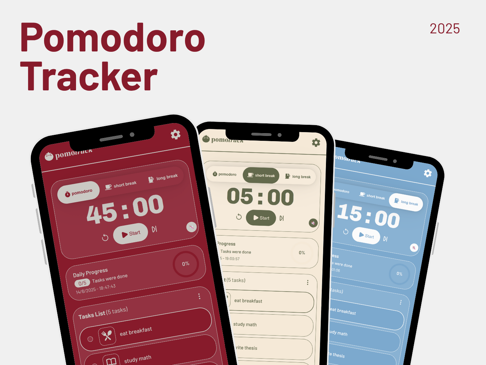
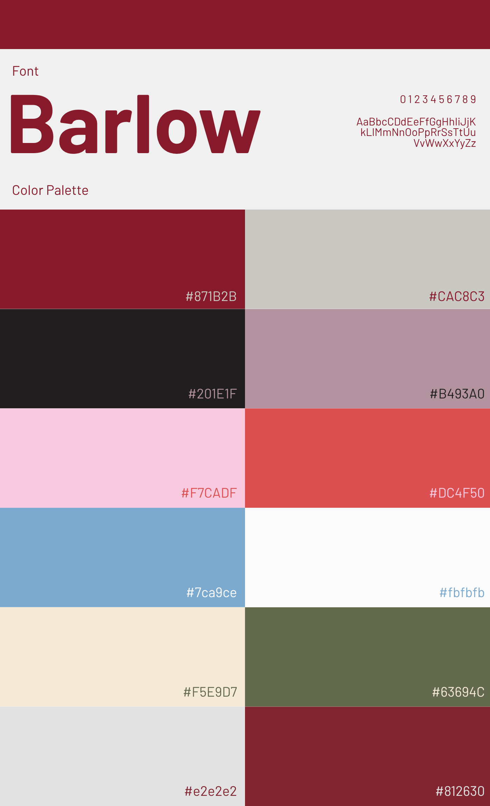
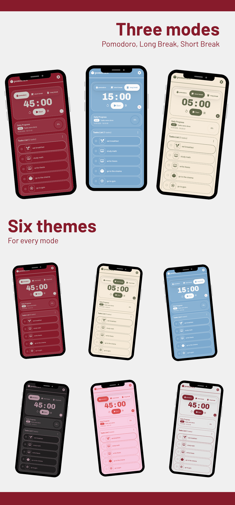
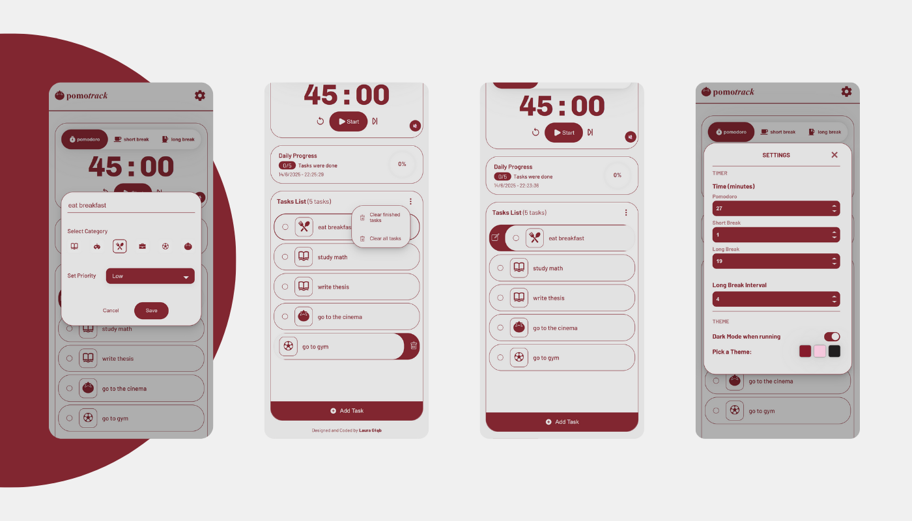
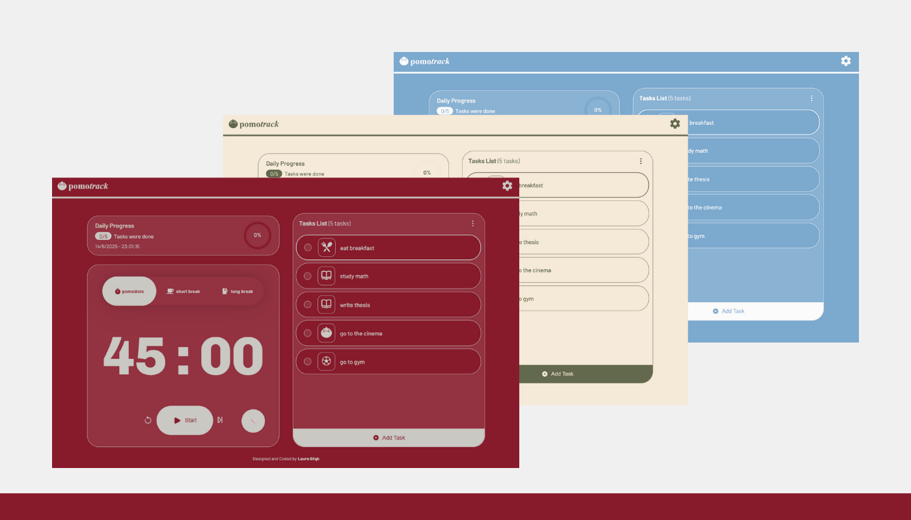
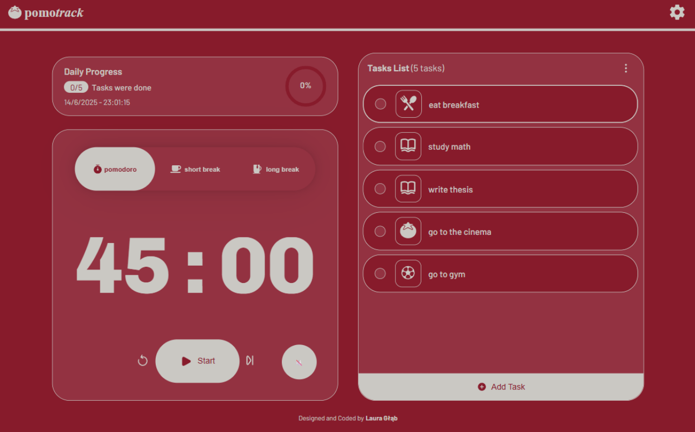

# PomoTrack – Stay Focused, Get Things Done



## 📚 Table of Contents  
- [About the Project](#about-the-project)  
- [Features](#features)  
- [Design & Branding](#design--branding)
- [How It Works](#how-it-works)  
- [Why PomoTrack?](#why-pomotrack)
- [Built With](#built-with)    
- [License](#license)  

---

## 🧠 About the Project  
**PomoTrack** is a productivity web app that blends the **Pomodoro Technique** with a structured **To-Do list**, helping you balance focus and rest.  
Created to promote mindful work sessions, this app allows users to **personalize their workflow**, track time, and stay consistent through visual feedback and dynamic design.

---

## ✨ Features  

### ⏳ **Pomodoro Timer Modes**  
- 3 customizable modes: **Focus**, **Short Break**, **Long Break**  
- Smooth transitions and real-time updates  
- Ambient focus sounds for deep concentration  

### 📝 **Smart To-Do List**  
- Add, edit, and categorize tasks  
- Prioritize work by urgency (Low / Medium / High)  
- Delete completed or all tasks at once  

### 📊 **Productivity Insights**  
- Track **total focus time** and **completed tasks**  
- View logs by day for better reflection  

### 🌓 **Dark / Light Mode**  
- Theme adjusts automatically or manually  
- Colors shift dynamically with Pomodoro phases  

### 📱 **Responsive Design**  
- Optimized for **desktop**, **tablet**, and **mobile**  
- Fluid, component-based layout  

---

## 🎨 Design & Branding  



PomoTrack’s branding is based on a **calm yet energetic palette** that reflects different states of focus and rest.  
Each mode uses distinct colors and font contrast to help users **visually feel their workflow**.

| Mode | Background | Font Color |
|------|-------------|------------|
| Focus | `#871B2B` (red) | `#CAC8C3` |
| Deep Work | `#201E1F` (black) | `#B493A0` |
| Calm | `#F7CADF` (pink) | `#DC4F50` |
| Reflect | `#7CA9CE` (blue) | `#FBFBFB` |
| Neutral | `#F5E9D7` (beige) | `#63694C` |

### 🖋️ Typography
- **Albert Sans** – clean, geometric, and humanist, used for primary UI and buttons.  
- **Barlow** – versatile sans-serif for headings and labels.  
- **Chivo Mono** – used in the timer display and coding-inspired components for contrast.

---

### 📸 UI Showcase  






---

## ⚙️ How It Works  
1. **Set Your Timer** — Choose Focus or Break mode.  
2. **Manage Tasks** — Add and prioritize tasks.  
3. **Track Progress** — View logs and stats.  
4. **Stay Consistent** — Let the design and sound guide your rhythm.

---

## 💡 Why PomoTrack?  
Unlike generic Pomodoro apps, **PomoTrack** merges time tracking, task management, and UX design principles into one minimalist interface.  
Every color, font, and animation is meant to reduce cognitive load and enhance focus — **form meets function**.

---

## 🛠️ Built With  

- ⚛️ [**React**](https://reactjs.org/) – Component-based UI  
- ⚡ [**Vite**](https://vitejs.dev/) – Fast build tool  
- 🎨 **CSS Modules** – Scoped, maintainable styling  
- 🧠 **Custom React Hooks** – Reusable logic for timer and tasks  
- 💾 **LocalStorage** – Persistent data without backend  
- 🔊 **Audio Integration** – Ambient focus sounds  
- 📱 **Media Queries** – Responsive design  

---

## 🧾 License  

[](LICENSE)

---

## 🚀 Get Started  
Clone the repository and start focusing smarter:  

```bash
git clone https://github.com/yourusername/pomotrack.git
cd pomotrack
npm install
npm run dev
